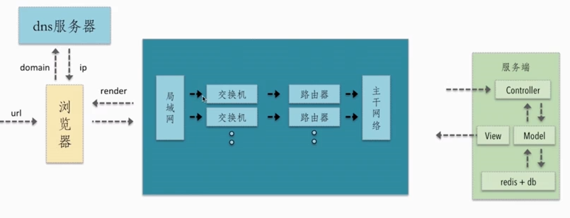
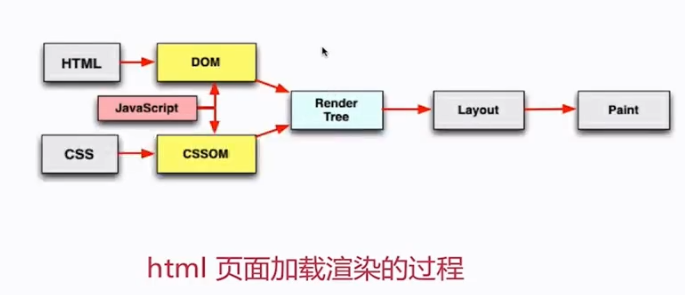
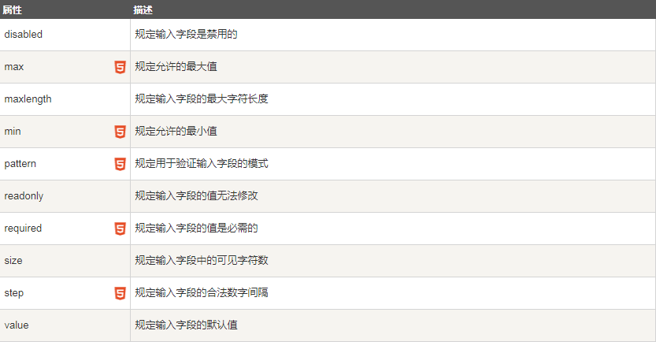
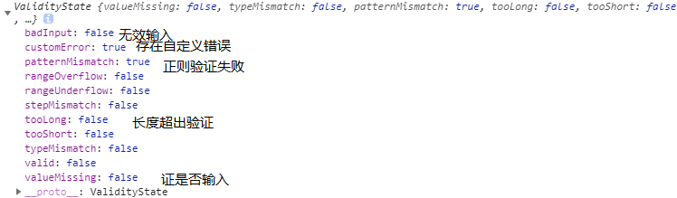

# 前端性能的优化

## 1.资源合并和压缩

-   减少 http 请求数目，减少请求资源大小
    
    > 前端性能优化的核心是深入理解 http 请求的过程
    -   了解浏览器的请求资源的过程
    -   了解可以在哪些地方可以优化
        -   dns 缓存减少 dns 查询时间
        -   网络的请求走最近的网环境（cdn）
        -   相同的静态资源的缓存
        -   减少 http 的大小
        -   减少 http 的请求
        -   服务端渲染
-   掌握压缩与合并的原理
    -   合并
        减少 http 的个数
    -   压缩
        减少 http 请求的大小
        -   html 的压缩： 1.空格，回车等一些对浏览器没有意义的字符，但是这个压缩的效果量级较少，但是对于那些高访问的网站来说就很有价值。 2.压缩方式：
            -   在线的压缩
            -   node 的提供的 html-minifier 工具
            -   后端模板渲染压缩
        -   css 的压缩 1.无效代码的删除 ，css 语意合并 2.压缩方式：
            -   在线压缩
            -   html-nimifier 对 css 的压缩
            -   使用 clear-css 对 css 压缩
        -   js 的压缩和混乱 1.无效的字符的删除，删除注释，代码语意的删减和优化，代码保护（代码的优化，代码的安全性 ）
        -   文件合并  
             文件合并能够有效的减少网络请求，同时还能获取数据的稳定性较少丢包的问题，但是文件合并还是有问题：1. 首屏渲染问题 2.缓存失效问题，合并后任意一个文件的高边都可能导致文件缓存失效的问题，解决方式：
            -   公共库打包成一个，业务代码打包成一个
            -   不同页面，单独打包
            -   见机行事，要针对不同的场景
                可以使用 node,在线网站的文件合并，构建工具
-   在线网站和 fis3 的两种压缩合并

## 2.图片的相关优化

-   图片优化的核心
    JPG:有损压缩，不支持透明
    png8/24/32 的区别：
    -   png8 256 色 + 支持透明 ：小，但是颜色不丰富，表示一个颜色只需要 8bit
    -   png24 2^24 色 + 不支持透明
    -   png32 2^24 色 + 支持透明 增加了 8 位来支持透明位
        webp ：压缩好，但是存在 ios webview 上有兼容问题
        svg 矢量图：代码内嵌，图片相对简单的
-   图片的优化
    -   图片压缩 ：tinypng.com
    -   图片格式转化：将 png,jpg 转为 webp,权衡 base64 的问题，inline-img

## 3.css 和 js 的加载

-   渲染流程：
    
-   渲染特点
    -   顺序执行，并发加载：受到浏览器同一个域的并发加载限制，可以使用不同域名的保存资源
    -   是否阻塞
    -   依赖关系：使用 async 加载 script 资源的时候就失去了代码的依赖方式，defer 的方式
    -   引入方式：单页面的按需加载
-   css 阻塞
    css 阻塞 js 执行，不阻塞脚本的加载，在 head 中的阻塞页面的渲染
-   js 阻塞  
     直接引入会阻塞页面的渲染，不阻塞资源的加载，顺序执行
-   懒加载和预加载  
     懒加载：延迟加载----图片进入可视区域后请求图片资源，对于电商等图片多的场景很实用，同时可以减少无用资源的加载，减少页面阻塞，只有 img 的 src 属性被设置才去请求数据，图片的路径开始放在 data-src 一类的属性上，等到监听事件触发的时候才去设置 src 属性，这个时候就去获取图片数据
    预加载：提前加载 ---- 图片等静态资源在使用之前提前请求，能从缓存中读取，例如 webgl 的一些处理

# css 常见的处理

## 1.背景边框的处理

# 项目中的常见问题处理

## 1.输入框检验的问题



上图是在做表单验证的时候的常用的属性，在项目开发中经常会出现在表单中进行输入验证，在不考虑使用 UI 框架的情况下分析输入限制的问题。

下边我们在不使用任何 UI 框架的情况下做表单数据验证
input.validity：该属性记录了输入的值的正确性，该属性中包含

上述属性值的特性：

-   只要有一个验证方面错误，某个属性就为 true，valid 值为 false

-   只有没有任何验证错误，所有的属性都为 false，valid 才能为 true

-   上述的每个错误在浏览器内部都有一个预定义的错误提示消息

-   所有的错误消息中，只要存在“自定义的错误消息”，浏览器只显示自定义的错误消息，优先级高于浏览器预定义的错误消息

-   当前没有自定义错误消息，所以 customError :  false 1.使用其 pattern 进行正则验证

### 1.直接使用 input 的 pattern 属性用于验证元素的值的正则表达式。`<input pattern="regexp">`

```
//获取input
var myinput = document.querySelector("#input");
//检验，修改
function invalidFun(e){
    var tag = e.target ;
    //上图的属性
    console.info(tag.validity);
    //自定义的提示性文字
    e.setCustomValidity("格式不正确！请输入合法的三位数。")
}
//每一个input都有该事件，用来监听出错的时候的处理
myinput.addEventListener("invalid" ,invalidFun,false)
```

### 2.直接使用 input 的输入事件进行处理

`<input οnkeyup="this.value = this.value.replace(/\D/g,'')" onafterpaste="this.value = this.value.replace(/\D/g,'')">`

监听键盘输入事件后直接使用正则进行检验，替代不合法输入

### 3.常见的正则规则
直接看链接，写的很全面：https://juejin.im/post/5d245d4151882555300feb77?utm_source=gold_browser_extension

### 4.针对项目的规则
- 输入框长度限制 15 个字符
- 只能输入 数字，中文，英文大小写，下划线

上边规则的正则为