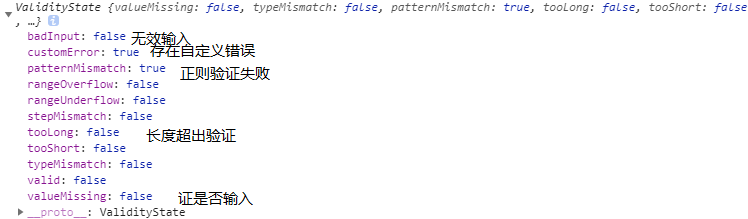

# 项目中的常见问题处理

---

## 1.输入框检验的问题


上图是在做表单验证的时候的常用的属性，在项目开发中经常会出现在表单中进行输入验证，在不考虑使用 UI 框架的情况下分析输入限制的问题:

input.validity：该属性记录了输入的值的正确性，该属性中包含

上述属性值的特性：

-   只要有一个验证方面错误，某个属性就为 true，valid 值为 false

-   只有没有任何验证错误，所有的属性都为 false，valid 才能为 true

-   上述的每个错误在浏览器内部都有一个预定义的错误提示消息

-   所有的错误消息中，只要存在“自定义的错误消息”，浏览器只显示自定义的错误消息，优先级高于浏览器预定义的错误消息

-   当前没有自定义错误消息，所以 customError :  false 1.使用其 pattern 进行正则验证

### 1.直接使用 pattern 属性验证正则表达式。

`<input pattern="regexp">`

```
//获取input
var myinput = document.querySelector("#input");
//检验，修改
function invalidFun(e){
    var tag = e.target ;
    //上图的属性
    console.info(tag.validity);
    //自定义的提示性文字
    e.setCustomValidity("格式不正确！请输入合法的三位数。")
}
//每一个input都有该事件，用来监听出错的时候的处理
myinput.addEventListener("invalid" ,invalidFun,false)
```

### 2.直接使用 input 的输入事件进行处理

`<input οnkeyup="this.value = this.value.replace(/\D/g,'')" onafterpaste="this.value = this.value.replace(/\D/g,'')">`

监听键盘输入事件后直接使用正则进行检验，替代不合法输入

### 3.自定义插件验证，直接上代码：

```javascript
//数据校验
export default class CheckForm {
    /**
     * 构造函数，初始化数据
     * @param {Objecct} prop 初始化数据需要得参数 
     */
    constructor(prop) {
        this.input = prop
        this.errorMessage = '通过校验' // 错误信息
        this.pass = true // 校验是否通过
    }

    /**
     * 输入数据进行校验，链式操作，如果有
     * 异步没有通过验证进不能继续执行下去
     * 直接返回false
     * @param {Any} input 需要校验的数据 
     */
    data(input) {
        if (!this.pass) return this

        this.input = input
        return this
    }
    //下边是一些常用的校验规则

    /**
     * 必填，不能为空校验
     * @param {String} message 校验失败的错误提示
     */
    isRequired(message) {
        if (!this.pass) return this

        if (
            /^\s*$/g.test(this.input) ||
            this.input === null ||
            this.input === undefined
        ) {
            this.errorMessage = message
            this.pass = false
        }
        return this
    }


    /**
     * 最小长度校验
     * @param {Number} length 校验失败的错误提示
     * @param {String} message 校验失败的错误提示
     */
    minLength(length, message) {
        if (!this.pass) return this

        if (this.input.length < length) {
            this.errorMessage = message
            this.pass = false
        }
        return this
    }
    /**
     * 最大长度校验
     * @param {Number} length 校验失败的错误提示
     * @param {String} message 校验失败的错误提示
     */
    maxLength(length, message) {
        if (!this.pass) return this

        if (this.input.length > length) {
            this.errorMessage = message
            this.pass = false
        }
        return this
    }
    /**
     * 用户名检验 字母，数字，下划线，减号
     * @param {String} message 校验失败的错误提示
     */
    isName(message) {
        if (!this.pass) return this

        const nameReg = /^[a-zA-Z0-9_-]{4,16}$/
        if (!nameReg.test(this.input)) {
            this.errorMessage = message
            this.pass = false
        }
        return this
    }

    /**
     * 邮箱校验
     * @param {String} message 校验失败的错误提示
     */
    isEmail(message) {
        if (!this.pass) return this

        const emailReg = /^[a-z0-9]+([._\\-]*[a-z0-9])*@([a-z0-9]+[-a-z0-9]*[a-z0-9]+.){1,63}[a-z0-9]+$/
        if (!emailReg.test(this.input)) {
            this.errorMessage = message
            this.pass = false
        }
        return this
    }

    /**
     * url校验
     * @param {String} message 校验失败的错误提示
     */
    isURL(message) {
        if (!this.pass) return this

        const urlReg = new RegExp(
            '^(?!mailto:)(?:(?:http|https|ftp)://|//)(?:\\S+(?::\\S*)?@)?(?:(?:(?:[1-9]\\d?|1\\d\\d|2[01]\\d|22[0-3])(?:\\.(?:1?\\d{1,2}|2[0-4]\\d|25[0-5])){2}(?:\\.(?:[0-9]\\d?|1\\d\\d|2[0-4]\\d|25[0-4]))|(?:(?:[a-z\\u00a1-\\uffff0-9]+-?)*[a-z\\u00a1-\\uffff0-9]+)(?:\\.(?:[a-z\\u00a1-\\uffff0-9]+-?)*[a-z\\u00a1-\\uffff0-9]+)*(?:\\.(?:[a-z\\u00a1-\\uffff]{2,})))|localhost)(?::\\d{2,5})?(?:(/|\\?|#)[^\\s]*)?$',
            'i'
        )
        if (!urlReg.test(this.input)) {
            this.errorMessage = message
            this.pass = false
        }
        return this
    }


    /**
     *  自定义正则校验，自己操作的了
     *  @param {Object RegExp} reg 自定义正则
     * @param {String} message 校验失败的错误提示
     */
    requireRegexp(reg, message) {
        if (!this.pass) return this

        if (!reg.test(this.input)) {
            this.errorMessage = message
            this.pass = false
        }
        return this
    }
}
//复制代码使用姿势如下：
import CheckForm from '文件路径'
//创建实例对象 
const checkForm = new CheckForm()
//传值后开始链式操作
checkForm
    .data('1234')
    .isRequired('id不能为空')
    .minLength(3, 'id不能少于3位')
    .maxLength(5, 'id不能多于5位')

    .data('1234@qq.')
    .isRequired('邮箱不能为空')
    .isEmail('邮箱格式不正确')

    .data('http:dwd')
    .isRequired('url不能为空')
    .isUrl('url格式不正确')
//检验结果直接判断实例对象的pass属性判断是否通过验证，实例对象的errorMessage保存错误提示信息
if (!checkForm.pass) {
    console.error(checkForm.errorMessage)
    return
}
```

上边就是一个实现了的校验规则，其特点是包含了常规的检验规则，同时还可以自定义校验规则。在不对外部产生附操作的情况下，通过链式的方式进行校验，最终返回验证结果的同时，还能进行收集错误信息。

### 4.常见的正则规则

直接看链接，写的很全面：https://juejin.im/post/5d245d4151882555300feb77?utm_source=gold_browser_extension

### 5.针对项目的规则
 
-   输入框长度限制 15 个字符
-   只含有汉字、数字、字母、下划线，下划线位置不限

上边规则的正则为：/^[a-zA-Z0-9_\u4e00-\u9fa5]{0,15}\$/
