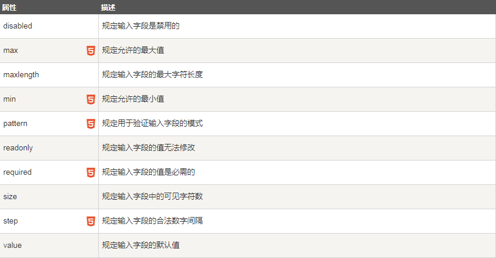

# 项目中的常见问题处理
----
## 1.输入框检验的问题



上图是在做表单验证的时候的常用的属性，在项目开发中经常会出现在表单中进行输入验证，在不考虑使用 UI 框架的情况下分析输入限制的问题:

input.validity：该属性记录了输入的值的正确性，该属性中包含

上述属性值的特性：

-   只要有一个验证方面错误，某个属性就为 true，valid 值为 false

-   只有没有任何验证错误，所有的属性都为 false，valid 才能为 true

-   上述的每个错误在浏览器内部都有一个预定义的错误提示消息

-   所有的错误消息中，只要存在“自定义的错误消息”，浏览器只显示自定义的错误消息，优先级高于浏览器预定义的错误消息

-   当前没有自定义错误消息，所以 customError :  false 1.使用其 pattern 进行正则验证

### 1.直接使用 pattern 属性验证正则表达式。

`<input pattern="regexp">`

```
//获取input
var myinput = document.querySelector("#input");
//检验，修改
function invalidFun(e){
    var tag = e.target ;
    //上图的属性
    console.info(tag.validity);
    //自定义的提示性文字
    e.setCustomValidity("格式不正确！请输入合法的三位数。")
}
//每一个input都有该事件，用来监听出错的时候的处理
myinput.addEventListener("invalid" ,invalidFun,false)
```

### 2.直接使用 input 的输入事件进行处理

`<input οnkeyup="this.value = this.value.replace(/\D/g,'')" onafterpaste="this.value = this.value.replace(/\D/g,'')">`

监听键盘输入事件后直接使用正则进行检验，替代不合法输入

### 3.常见的正则规则

直接看链接，写的很全面：https://juejin.im/post/5d245d4151882555300feb77?utm_source=gold_browser_extension

### 4.针对项目的规则

-   输入框长度限制 15 个字符
-   只含有汉字、数字、字母、下划线，下划线位置不限

上边规则的正则为：/^[a-zA-Z0-9_\u4e00-\u9fa5]{0,15}\$/
